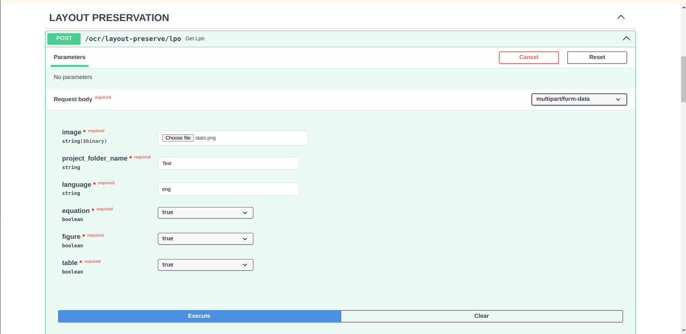
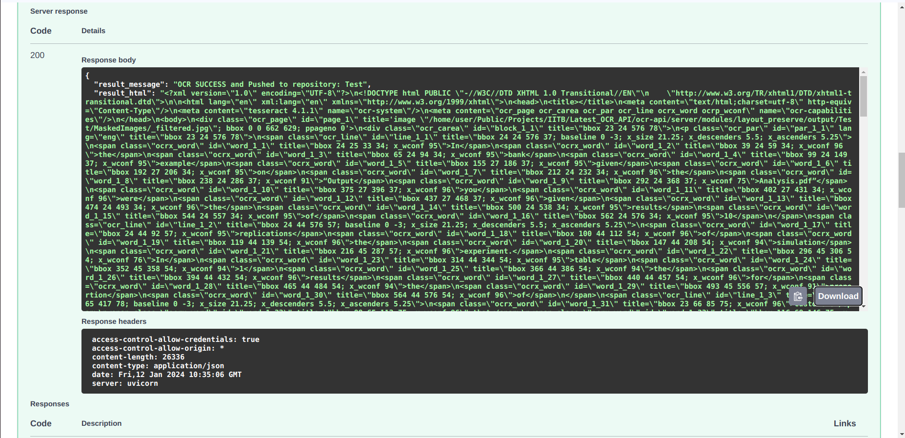

# OCR API - Layout Preservation

## Description

An endpoint to return the OCR of an image has been integrated to the code. This integration will encompass different classes such as Tables, Equations, Figures, and Text to ensure the preservation of the document's layout during the optical character recognition process. Implemented in docker. Processing code repository [here](https://github.com/iitb-research-code/docker-layout-pres-ocr), use to build docker image.

## API Endpoint and usage

Created a module server/modules/layout_preserve to have the endpoint for layout preservation.

**Layout preservation endpoint - /ocr/layout-preserve/lpo**

**Input:**
- An image file.
- Output set name or document name to be given to final result folder in output directory.
- Language to perform OCR.
- Boolean, True if we want to preserve equation in the HOCRs.
- Boolean, True if we want to preserve figure in the HOCRs.
- Boolean, True if we want to preserve table in the HOCRs.


***Note:***
<br> *If table, equation and figure detection are **all** set to False then layout preservation will turn False*

### Example

**Request image**


**Response image**


## Changes Integrated
### layout_preserve module
- The layout_preserve module has been introduced to centralize the code responsible for detecting and recognizing layout elements, including Tables, Equations, Figures, and Text. 

### routes.py
- The endpoint `/ocr/layout-preserve/lpo` has been introduced to facilitate layout preservation across various classes within the API.
- Users provides the required input, and the API returns a JSON response indicating the success or failure of the OCR process as well as an html result of the processed image .

### helper.py
- The `delete_files_in_directory` function is used to clear the contents of a directory before saving new files. 
- The `save_uploaded_images` function is implemented for saving uploaded images to a specified directory, replacing any existing files with the same names.

### models.py
- The purpose of this code is to define a clear and structured data model `OCRResponse` for representing the output of the OCR operation.

In app.py line 36 imported router from routes.py of the layout_preserve.

### Requirements

No need for external requirements as docker container is used for running

**Example JSON Response for Success:**
```json
{
  "result_message": "OCR SUCCESS and Pushed to repository: Test",
  "result_html": "<?xml version=\"1.0\" encoding=\"UTF-8\"?>\n<!DOCTYPE html PUBLIC \"-//W3C//DTD XHTML 1.0 Transitional//EN\"\n    \"http://www.w3.org/TR/xhtml1/DTD/xhtml1-transitional.dtd\">\n\n<html lang=\"en\" xml:lang=\"en\" xmlns=\"http://www.w3.org/1999/xhtml\">\n<head>\n<title></title>\n<meta content=\"text/html;charset=utf-8\" http-equiv=\"Content-Type\"/>\title=\"bbox 23 25 33 34; x_wconf 54\">In</span>\n<span class=\"ocrx_word\" id=\"word_1_2\" title=\"bbox 39 24 59 34; x_wconf 95\">the</span>\n<span class=\"ocrx_word\" id=\"word_1_3\" title=\"bbox 65 24 94 34; x_wconf 95\">bank</span>\n<span class=\"ocrx_word\" id=\"word_1_4\" title=\"bbox 99 24 149 37; x_wconf 96\">example</span>\n<span class=\"ocrx_word\" id=\"word_1_5\" title=\"bbox 165 27 186 34; x_wconf 96\">given</span>\n<span class=\"ocrx_word\" id=\"word_1_6\" title=\"bbox 192 27 206 34; x_wconf 96\">on</span>\n<span class=\"ocrx_word\" id=\"word_1_7\" title=\"bbox 212 24 232 34; x_wconf 96\">the</span>\n<span class=\"ocrx_word\" id=\"word_1_8\" title=\"bbox 238 24 286 37; x_wconf 93\">“Output</span>\n<span>  title=\"bbox 23 44 576 57; baseline 0 -3; x_size 21.25; x_descenders 5.5; </body>\n</html>\n"
}
```
